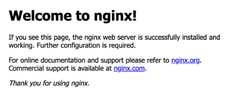

[https://learn.hashicorp.com/tutorials/terraform/install-cli?in=terraform/aws-get-started](https://learn.hashicorp.com/tutorials/terraform/install-cli?in=terraform/aws-get-started)

# Install Terraform
Followed the Homebrew on OS X  
Install the HashiCorp tap, a repository of all our Homebrew packages.
```
brew tap hashicorp/tap
```

Install Terraform
```
brew install hashicorp/tap/terraform
```

Update Homebrew
```
brew update
```

Run the upgrade command to download and use the latest Terraform version
```
brew upgrade hashicorp/tap/terraform
```

Verify the installation
```
terraform -help
```


# Enable tab completion
Followed the Zsh steps  
If .zshrc does not exist yet in your home folder
```
touch ~/.zshrc
```

Install the autocomplete package
```
terraform -install-autocomplete
```

# Quick start tutorial Docker
Followed Docker desktop for Mac  

Start Docker desktop
```
open -a Docker
```

Create a directory and go into it
```
mkdir learn-terraform-docker-container
cd learn-terraform-docker-container
```

Initialise the project
```
terraform init
```

Plan and apply the changes, type yes and hit enter when prompted
```
terraform apply
```

Go to [http://localhost:8000/](http://localhost:8000/) to check the output of the webserver.


With below command you can see the docker container
```
docker ps
```

Stop and destroy
```
terraform destroy
```